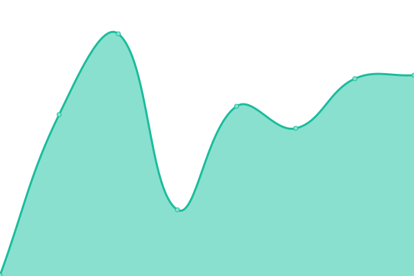
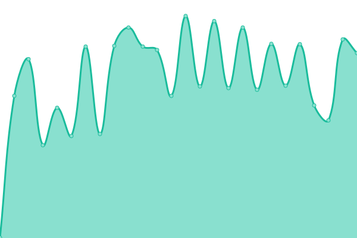
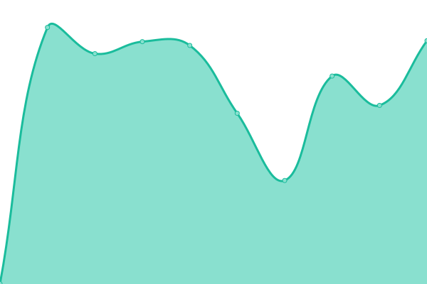
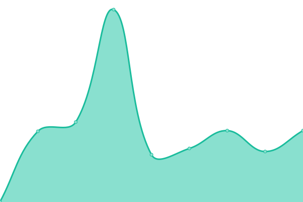
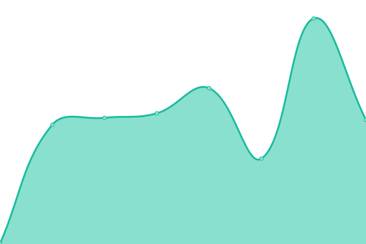
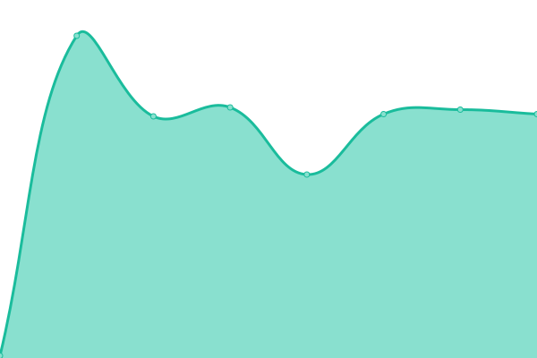
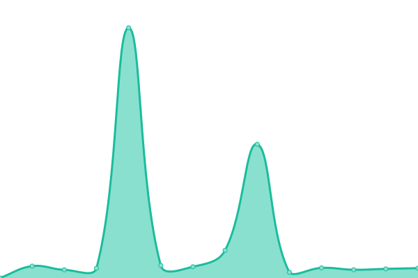
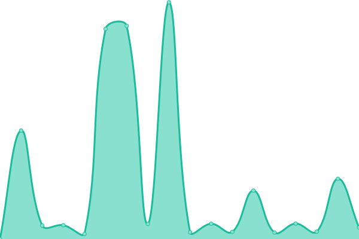
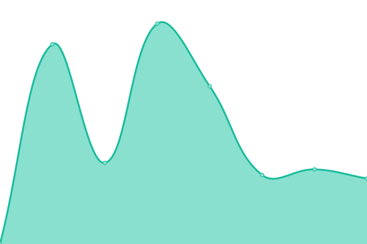

# [📈 Live Status](https://wwmwabini.github.io/statuspages): <!--live status--> **🟩 All systems operational**

This repository contains the open-source uptime monitor and status page for [Wallace Mwabini](w.mwabini.co.ke), powered by [Upptime](https://github.com/upptime/upptime).

With [Upptime](https://upptime.js.org), you can get your own unlimited and free uptime monitor and status page, powered entirely by a GitHub repository. We use [Issues](https://github.com/wwmwabini/statuspages/issues) as incident reports, [Actions](https://github.com/wwmwabini/statuspages/actions) as uptime monitors, and [Pages](https://wwmwabini.github.io/statuspages) for the status page.

<!--start: status pages-->
<!-- This summary is generated by Upptime (https://github.com/upptime/upptime) -->
<!-- Do not edit this manually, your changes will be overwritten -->
<!-- prettier-ignore -->
| URL | Status | History | Response Time | Uptime |
| --- | ------ | ------- | ------------- | ------ |
|  [Truehost.co.ke](https://truehost.co.ke) | 🟩 Up | [truehost-co-ke.yml](https://github.com/wwmwabini/statuspages/commits/HEAD/history/truehost-co-ke.yml) | 

 435ms
     
 | 

<a href="https://status.truehost.com/history/truehost-co-ke">87.89%</a>
    

|  [Truehost.com.ng](https://truehost.com.ng) | 🟩 Up | [truehost-com-ng.yml](https://github.com/wwmwabini/statuspages/commits/HEAD/history/truehost-com-ng.yml) | 

 260ms
     
 | 

<a href="https://status.truehost.com/history/truehost-com-ng">87.89%</a>
    

|  [Truehost.co.za](https://truehost.co.za) | 🟩 Up | [truehost-co-za.yml](https://github.com/wwmwabini/statuspages/commits/HEAD/history/truehost-co-za.yml) | 

 543ms
     
 | 

<a href="https://status.truehost.com/history/truehost-co-za">98.40%</a>
    

|  [Truehost.cloud](https://truehost.cloud) | 🟩 Up | [truehost-cloud.yml](https://github.com/wwmwabini/statuspages/commits/HEAD/history/truehost-cloud.yml) | 

 242ms
     
 | 

<a href="https://status.truehost.com/history/truehost-cloud">100.00%</a>
    

|  [Truehost.com](https://truehost.com) | 🟩 Up | [truehost-com.yml](https://github.com/wwmwabini/statuspages/commits/HEAD/history/truehost-com.yml) | 

 477ms
     
 | 

<a href="https://status.truehost.com/history/truehost-com">100.00%</a>
    

|  [Truehost.co.in](https://truehost.co.in) | 🟩 Up | [truehost-co-in.yml](https://github.com/wwmwabini/statuspages/commits/HEAD/history/truehost-co-in.yml) | 

 500ms
     
 | 

<a href="https://status.truehost.com/history/truehost-co-in">98.33%</a>
    

|  [Truehost.london](https://truehost.london) | 🟩 Up | [truehost-london.yml](https://github.com/wwmwabini/statuspages/commits/HEAD/history/truehost-london.yml) | 

 4349ms
     
 | 

<a href="https://status.truehost.com/history/truehost-london">97.49%</a>
    

|  [Truehost.ca](https://truehost.ca) | 🟩 Up | [truehost-ca.yml](https://github.com/wwmwabini/statuspages/commits/HEAD/history/truehost-ca.yml) | 

 2033ms
     
 | 

<a href="https://status.truehost.com/history/truehost-ca">99.91%</a>
    

|  [Zola](https://chat.olitt.net) | 🟩 Up | [zola.yml](https://github.com/wwmwabini/statuspages/commits/HEAD/history/zola.yml) | 

 1213ms
     
 | 

<a href="https://status.truehost.com/history/zola">99.85%</a>
    

|  [Tickets](https://tickets.olitt.com/en) | 🟩 Up | [tickets.yml](https://github.com/wwmwabini/statuspages/commits/HEAD/history/tickets.yml) | 

 2157ms
     
 | 

<a href="https://status.truehost.com/history/tickets">98.42%</a>
    

|  [Voice Call](https://truehost.elastix.com/webclient/#/login) | 🟩 Up | [voice-call.yml](https://github.com/wwmwabini/statuspages/commits/HEAD/history/voice-call.yml) | 

 668ms
     
 | 

<a href="https://status.truehost.com/history/voice-call">100.00%</a>
    

|  [frt106](https://frt106.truehost.cloud) | 🟩 Up | [frt106.yml](https://github.com/wwmwabini/statuspages/commits/HEAD/history/frt106.yml) | 

 425ms
     
 | 

<a href="https://status.truehost.com/history/frt106">100.00%</a>
    

|  [bhs105](https://bhs105.truehost.cloud) | 🟩 Up | [bhs105.yml](https://github.com/wwmwabini/statuspages/commits/HEAD/history/bhs105.yml) | 

 193ms
     
 | 

<a href="https://status.truehost.com/history/bhs105">99.82%</a>
    

|  [gra106](https://gra106.truehost.cloud) | 🟩 Up | [gra106.yml](https://github.com/wwmwabini/statuspages/commits/HEAD/history/gra106.yml) | 

 402ms
     
 | 

<a href="https://status.truehost.com/history/gra106">100.00%</a>
    

|  [gra107](https://gra107.truehost.cloud) | 🟩 Up | [gra107.yml](https://github.com/wwmwabini/statuspages/commits/HEAD/history/gra107.yml) | 

 402ms
     
 | 

<a href="https://status.truehost.com/history/gra107">100.00%</a>
    

|  [gra108](https://gra108.truehost.cloud) | 🟩 Up | [gra108.yml](https://github.com/wwmwabini/statuspages/commits/HEAD/history/gra108.yml) | 

 399ms
     
 | 

<a href="https://status.truehost.com/history/gra108">100.00%</a>
    

|  [gra109](https://gra109.truehost.cloud) | 🟩 Up | [gra109.yml](https://github.com/wwmwabini/statuspages/commits/HEAD/history/gra109.yml) | 

 393ms
     
 | 

<a href="https://status.truehost.com/history/gra109">100.00%</a>
    

|  [gra110](https://gra110.truehost.cloud) | 🟩 Up | [gra110.yml](https://github.com/wwmwabini/statuspages/commits/HEAD/history/gra110.yml) | 

 395ms
     
 | 

<a href="https://status.truehost.com/history/gra110">99.86%</a>
    

|  [lim106](https://lim106.truehost.cloud) | 🟩 Up | [lim106.yml](https://github.com/wwmwabini/statuspages/commits/HEAD/history/lim106.yml) | 

 416ms
     
 | 

<a href="https://status.truehost.com/history/lim106">100.00%</a>
    

|  [lim107](https://lim107.truehost.cloud) | 🟩 Up | [lim107.yml](https://github.com/wwmwabini/statuspages/commits/HEAD/history/lim107.yml) | 

 344ms
     
 | 

<a href="https://status.truehost.com/history/lim107">100.00%</a>
    

|  [lim108](https://lim108.truehost.cloud) | 🟩 Up | [lim108.yml](https://github.com/wwmwabini/statuspages/commits/HEAD/history/lim108.yml) | 

 415ms
     
 | 

<a href="https://status.truehost.com/history/lim108">100.00%</a>
    

|  [lim109](https://lim109.truehost.cloud) | 🟩 Up | [lim109.yml](https://github.com/wwmwabini/statuspages/commits/HEAD/history/lim109.yml) | 

 428ms
     
 | 

<a href="https://status.truehost.com/history/lim109">100.00%</a>
    

|  [lim110](https://lim110.truehost.cloud) | 🟩 Up | [lim110.yml](https://github.com/wwmwabini/statuspages/commits/HEAD/history/lim110.yml) | 

 421ms
     
 | 

<a href="https://status.truehost.com/history/lim110">100.00%</a>
    

|  [lim112](https://lim112.truehost.cloud) | 🟩 Up | [lim112.yml](https://github.com/wwmwabini/statuspages/commits/HEAD/history/lim112.yml) | 

 416ms
     
 | 

<a href="https://status.truehost.com/history/lim112">100.00%</a>
    

|  [lon105](https://lon105.truehost.cloud) | 🟩 Up | [lon105.yml](https://github.com/wwmwabini/statuspages/commits/HEAD/history/lon105.yml) | 

 486ms
     
 | 

<a href="https://status.truehost.com/history/lon105">100.00%</a>
    

|  [lon106](https://lon106.truehost.cloud) | 🟩 Up | [lon106.yml](https://github.com/wwmwabini/statuspages/commits/HEAD/history/lon106.yml) | 

 398ms
     
 | 

<a href="https://status.truehost.com/history/lon106">100.00%</a>
    

|  [lon108](https://lon108.truehost.cloud) | 🟩 Up | [lon108.yml](https://github.com/wwmwabini/statuspages/commits/HEAD/history/lon108.yml) | 

 309ms
     
 | 

<a href="https://status.truehost.com/history/lon108">99.92%</a>
    

|  [lon109](https://lon109.truehost.cloud) | 🟩 Up | [lon109.yml](https://github.com/wwmwabini/statuspages/commits/HEAD/history/lon109.yml) | 

 387ms
     
 | 

<a href="https://status.truehost.com/history/lon109">100.00%</a>
    

|  [nyc101](https://nyc101.truehost.cloud) | 🟩 Up | [nyc101.yml](https://github.com/wwmwabini/statuspages/commits/HEAD/history/nyc101.yml) | 

 251ms
     
 | 

<a href="https://status.truehost.com/history/nyc101">100.00%</a>
    

|  [nyc102](https://nyc102.truehost.cloud) | 🟩 Up | [nyc102.yml](https://github.com/wwmwabini/statuspages/commits/HEAD/history/nyc102.yml) | 

 251ms
     
 | 

<a href="https://status.truehost.com/history/nyc102">100.00%</a>
    

|  [pld107](https://pld107.truehost.cloud) | 🟩 Up | [pld107.yml](https://github.com/wwmwabini/statuspages/commits/HEAD/history/pld107.yml) | 

 442ms
     
 | 

<a href="https://status.truehost.com/history/pld107">100.00%</a>
    

|  [pld108](https://pld108.truehost.cloud) | 🟩 Up | [pld108.yml](https://github.com/wwmwabini/statuspages/commits/HEAD/history/pld108.yml) | 

 452ms
     
 | 

<a href="https://status.truehost.com/history/pld108">100.00%</a>
    

|  [pld109](https://pld109.truehost.cloud) | 🟩 Up | [pld109.yml](https://github.com/wwmwabini/statuspages/commits/HEAD/history/pld109.yml) | 

 360ms
     
 | 

<a href="https://status.truehost.com/history/pld109">100.00%</a>
    

|  [rbx106](https://rbx106.truehost.cloud) | 🟩 Up | [rbx106.yml](https://github.com/wwmwabini/statuspages/commits/HEAD/history/rbx106.yml) | 

 317ms
     
 | 

<a href="https://status.truehost.com/history/rbx106">100.00%</a>
    

|  [rbx107](https://rbx107.truehost.cloud) | 🟩 Up | [rbx107.yml](https://github.com/wwmwabini/statuspages/commits/HEAD/history/rbx107.yml) | 

 313ms
     
 | 

<a href="https://status.truehost.com/history/rbx107">100.00%</a>
    

|  [rbx108](https://rbx108.truehost.cloud) | 🟩 Up | [rbx108.yml](https://github.com/wwmwabini/statuspages/commits/HEAD/history/rbx108.yml) | 

 317ms
     
 | 

<a href="https://status.truehost.com/history/rbx108">100.00%</a>
    

|  [rbx109](https://rbx109.truehost.cloud) | 🟩 Up | [rbx109.yml](https://github.com/wwmwabini/statuspages/commits/HEAD/history/rbx109.yml) | 

 321ms
     
 | 

<a href="https://status.truehost.com/history/rbx109">100.00%</a>
    

|  [rbx110](https://rbx110.truehost.cloud) | 🟩 Up | [rbx110.yml](https://github.com/wwmwabini/statuspages/commits/HEAD/history/rbx110.yml) | 

 325ms
     
 | 

<a href="https://status.truehost.com/history/rbx110">100.00%</a>
    

|  [rbx111](https://rbx111.truehost.cloud) | 🟩 Up | [rbx111.yml](https://github.com/wwmwabini/statuspages/commits/HEAD/history/rbx111.yml) | 

 316ms
     
 | 

<a href="https://status.truehost.com/history/rbx111">100.00%</a>
    

|  [sbg106](https://sbg106.truehost.cloud) | 🟩 Up | [sbg106.yml](https://github.com/wwmwabini/statuspages/commits/HEAD/history/sbg106.yml) | 

 333ms
     
 | 

<a href="https://status.truehost.com/history/sbg106">100.00%</a>
    

|  [sbg108](https://sbg108.truehost.cloud) | 🟩 Up | [sbg108.yml](https://github.com/wwmwabini/statuspages/commits/HEAD/history/sbg108.yml) | 

 342ms
     
 | 

<a href="https://status.truehost.com/history/sbg108">100.00%</a>
    

|  [tor101](https://tor101.truehost.cloud) | 🟩 Up | [tor101.yml](https://github.com/wwmwabini/statuspages/commits/HEAD/history/tor101.yml) | 

 187ms
     
 | 

<a href="https://status.truehost.com/history/tor101">100.00%</a>
    

|  [tor102](https://tor102.truehost.cloud) | 🟩 Up | [tor102.yml](https://github.com/wwmwabini/statuspages/commits/HEAD/history/tor102.yml) | 

 183ms
     
 | 

<a href="https://status.truehost.com/history/tor102">100.00%</a>
    

|  [rbx112](https://rbx112.truehost.cloud) | 🟩 Up | [rbx112.yml](https://github.com/wwmwabini/statuspages/commits/HEAD/history/rbx112.yml) | 

 321ms
     
 | 

<a href="https://status.truehost.com/history/rbx112">100.00%</a>
    

|  [sm1::SMTP::STARTTLS](51.83.3.151) | 🟩 Up | [sm1-smtp-starttls.yml](https://github.com/wwmwabini/statuspages/commits/HEAD/history/sm1-smtp-starttls.yml) | 

 123ms
     
 | 

<a href="https://status.truehost.com/history/sm1-smtp-starttls">100.00%</a>
    

|  [sm1::SMTP::SSL](51.83.3.151) | 🟩 Up | [sm1-smtp-ssl.yml](https://github.com/wwmwabini/statuspages/commits/HEAD/history/sm1-smtp-ssl.yml) | 

 122ms
     
 | 

<a href="https://status.truehost.com/history/sm1-smtp-ssl">99.21%</a>
    

|  [sm1::IMAP](51.83.3.151) | 🟩 Up | [sm1-imap.yml](https://github.com/wwmwabini/statuspages/commits/HEAD/history/sm1-imap.yml) | 

 122ms
     
 | 

<a href="https://status.truehost.com/history/sm1-imap">100.00%</a>
    

|  [sm1::POP3](51.83.3.151) | 🟩 Up | [sm1-pop-3.yml](https://github.com/wwmwabini/statuspages/commits/HEAD/history/sm1-pop-3.yml) | 

 122ms
     
 | 

<a href="https://status.truehost.com/history/sm1-pop-3">100.00%</a>
    

|  [lon103::SMTP::STARTTLS](54.38.215.133) | 🟩 Up | [lon103-smtp-starttls.yml](https://github.com/wwmwabini/statuspages/commits/HEAD/history/lon103-smtp-starttls.yml) | 

 116ms
     
 | 

<a href="https://status.truehost.com/history/lon103-smtp-starttls">100.00%</a>
    

|  [lon103::SMTP::SSL](54.38.215.133) | 🟩 Up | [lon103-smtp-ssl.yml](https://github.com/wwmwabini/statuspages/commits/HEAD/history/lon103-smtp-ssl.yml) | 

 117ms
     
 | 

<a href="https://status.truehost.com/history/lon103-smtp-ssl">100.00%</a>
    

|  [lon103::IMAP](54.38.215.133) | 🟩 Up | [lon103-imap.yml](https://github.com/wwmwabini/statuspages/commits/HEAD/history/lon103-imap.yml) | 

 116ms
     
 | 

<a href="https://status.truehost.com/history/lon103-imap">100.00%</a>
    

|  [lon103::POP3](54.38.215.133) | 🟩 Up | [lon103-pop-3.yml](https://github.com/wwmwabini/statuspages/commits/HEAD/history/lon103-pop-3.yml) | 

 116ms
     
 | 

<a href="https://status.truehost.com/history/lon103-pop-3">100.00%</a>
    

|  [Jisort Portal](https://my.jisort.com) | 🟩 Up | [jisort-portal.yml](https://github.com/wwmwabini/statuspages/commits/HEAD/history/jisort-portal.yml) | 

 2780ms
     
 | 

<a href="https://status.truehost.com/history/jisort-portal">38.17%</a>
    

|  [Olitt Shops/Sites](https://www.olitt.com) | 🟩 Up | [olitt-shops-sites.yml](https://github.com/wwmwabini/statuspages/commits/HEAD/history/olitt-shops-sites.yml) | 

 2494ms
     
 | 

<a href="https://status.truehost.com/history/olitt-shops-sites">99.76%</a>
    

|  [Cloudpap VMs](https://console.cloudpap.com/) | 🟩 Up | [cloudpap-v-ms.yml](https://github.com/wwmwabini/statuspages/commits/HEAD/history/cloudpap-v-ms.yml) | 

 468ms
     
 | 

<a href="https://status.truehost.com/history/cloudpap-v-ms">100.00%</a>
    

|  [Jisort WP](https://jisort.com) | 🟩 Up | [jisort-wp.yml](https://github.com/wwmwabini/statuspages/commits/HEAD/history/jisort-wp.yml) | 

 691ms
     
 | 

<a href="https://status.truehost.com/history/jisort-wp">99.30%</a>
    

|  [Cloudpap WP](https://cloudpap.com) | 🟩 Up | [cloudpap-wp.yml](https://github.com/wwmwabini/statuspages/commits/HEAD/history/cloudpap-wp.yml) | 

 360ms
     
 | 

<a href="https://status.truehost.com/history/cloudpap-wp">100.00%</a>
    

|  [Odoo](https://dash.cloudoon.com) | 🟩 Up | [odoo.yml](https://github.com/wwmwabini/statuspages/commits/HEAD/history/odoo.yml) | 

 4250ms
     
 | 

<a href="https://status.truehost.com/history/odoo">80.56%</a>
    

|  [master.sbg2](master.sbg2.truehost.cloud) | 🟩 Up | [master-sbg2.yml](https://github.com/wwmwabini/statuspages/commits/HEAD/history/master-sbg2.yml) | 

 161ms
     
 | 

<a href="https://status.truehost.com/history/master-sbg2">99.89%</a>
    

|  [Namesilo](https://namesilo.com/) | 🟩 Up | [namesilo.yml](https://github.com/wwmwabini/statuspages/commits/HEAD/history/namesilo.yml) | 

 100ms
     
 | 

<a href="https://status.truehost.com/history/namesilo">98.81%</a>
    

|  [Connectreseller](https://global.connectreseller.com) | 🟩 Up | [connectreseller.yml](https://github.com/wwmwabini/statuspages/commits/HEAD/history/connectreseller.yml) | 

 484ms
     
 | 

<a href="https://status.truehost.com/history/connectreseller">100.00%</a>
    

|  [Kenic](https://registry.kenic.or.ke) | 🟩 Up | [kenic.yml](https://github.com/wwmwabini/statuspages/commits/HEAD/history/kenic.yml) | 

 2069ms
     
 | 

<a href="https://status.truehost.com/history/kenic">100.00%</a>
    

|  [NiRA](https://registry.nic.net.ng) | 🟩 Up | [ni-ra.yml](https://github.com/wwmwabini/statuspages/commits/HEAD/history/ni-ra.yml) | 

 1576ms
     
 | 

<a href="https://status.truehost.com/history/ni-ra">100.00%</a>
    

|  [CozaEPP](https://portal.registry.net.za/login.php) | 🟩 Up | [coza-epp.yml](https://github.com/wwmwabini/statuspages/commits/HEAD/history/coza-epp.yml) | 

 1581ms
     
 | 

<a href="https://status.truehost.com/history/coza-epp">100.00%</a>
    

<!--end: status pages-->

[**Visit our status website →**](https://wwmwabini.github.io/statuspages)

## 📄 License

- Powered by: [Upptime](https://github.com/upptime/upptime)
- Code: [MIT](./LICENSE) © [Wallace Mwabini](w.mwabini.co.ke)
- Data in the `./history` directory: [Open Database License](https://opendatacommons.org/licenses/odbl/1-0/)
