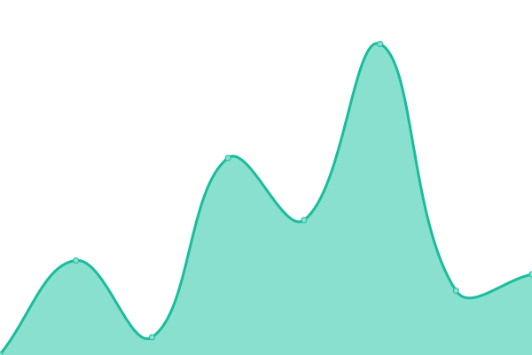
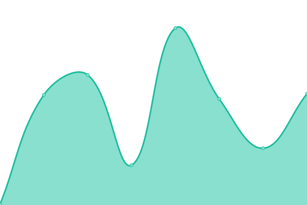

# [📈 Live Status](https://wwmwabini.github.io/statuspages): <!--live status--> **🟧 Partial outage**

This repository contains the open-source uptime monitor and status page for [Wallace Mwabini](w.mwabini.co.ke), powered by [Upptime](https://github.com/upptime/upptime).

With [Upptime](https://upptime.js.org), you can get your own unlimited and free uptime monitor and status page, powered entirely by a GitHub repository. We use [Issues](https://github.com/wwmwabini/statuspages/issues) as incident reports, [Actions](https://github.com/wwmwabini/statuspages/actions) as uptime monitors, and [Pages](https://wwmwabini.github.io/statuspages) for the status page.

<!--start: status pages-->
<!-- This summary is generated by Upptime (https://github.com/upptime/upptime) -->
<!-- Do not edit this manually, your changes will be overwritten -->
<!-- prettier-ignore -->
| URL | Status | History | Response Time | Uptime |
| --- | ------ | ------- | ------------- | ------ |
|  [Truehost.co.ke](https://truehost.co.ke) | 🟥 Down | [truehost-co-ke.yml](https://github.com/wwmwabini/statuspages/commits/HEAD/history/truehost-co-ke.yml) | 

 284ms
     
 | 

<a href="https://wwmwabini.github.io/statuspages/history/truehost-co-ke">0.00%</a>
    

|  [Truehost.com.ng](https://truehost.com.ng) | 🟥 Down | [truehost-com-ng.yml](https://github.com/wwmwabini/statuspages/commits/HEAD/history/truehost-com-ng.yml) | 

 223ms
     
 | 

<a href="https://wwmwabini.github.io/statuspages/history/truehost-com-ng">0.00%</a>
    

|  [Truehost.co.za](https://truehost.co.za) | 🟩 Up | [truehost-co-za.yml](https://github.com/wwmwabini/statuspages/commits/HEAD/history/truehost-co-za.yml) | 

 588ms
     
 | 

<a href="https://wwmwabini.github.io/statuspages/history/truehost-co-za">100.00%</a>
    

|  [Truehost.cloud](https://truehost.cloud) | 🟩 Up | [truehost-cloud.yml](https://github.com/wwmwabini/statuspages/commits/HEAD/history/truehost-cloud.yml) | 

 461ms
     
 | 

<a href="https://wwmwabini.github.io/statuspages/history/truehost-cloud">100.00%</a>
    

|  [Truehost.com](https://truehost.com) | 🟩 Up | [truehost-com.yml](https://github.com/wwmwabini/statuspages/commits/HEAD/history/truehost-com.yml) | 

 1224ms
     
 | 

<a href="https://wwmwabini.github.io/statuspages/history/truehost-com">100.00%</a>
    

|  [Truehost.co.in](https://truehost.co.in) | 🟩 Up | [truehost-co-in.yml](https://github.com/wwmwabini/statuspages/commits/HEAD/history/truehost-co-in.yml) | 

 628ms
     
 | 

<a href="https://wwmwabini.github.io/statuspages/history/truehost-co-in">100.00%</a>
    

|  [Truehost.london](https://truehost.london) | 🟩 Up | [truehost-london.yml](https://github.com/wwmwabini/statuspages/commits/HEAD/history/truehost-london.yml) | 

 4316ms
     
 | 

<a href="https://wwmwabini.github.io/statuspages/history/truehost-london">100.00%</a>
    

|  [Truehost.ca](https://truehost.ca) | 🟩 Up | [truehost-ca.yml](https://github.com/wwmwabini/statuspages/commits/HEAD/history/truehost-ca.yml) | 

 2031ms
     
 | 

<a href="https://wwmwabini.github.io/statuspages/history/truehost-ca">100.00%</a>
    

|  [Zola](https://chat.olitt.net) | 🟩 Up | [zola.yml](https://github.com/wwmwabini/statuspages/commits/HEAD/history/zola.yml) | 

 725ms
     
 | 

<a href="https://wwmwabini.github.io/statuspages/history/zola">100.00%</a>
    

|  [Tickets](https://tickets.olitt.com/en) | 🟩 Up | [tickets.yml](https://github.com/wwmwabini/statuspages/commits/HEAD/history/tickets.yml) | 

 904ms
     
 | 

<a href="https://wwmwabini.github.io/statuspages/history/tickets">100.00%</a>
    

|  [Voice Call](https://truehost.elastix.com/webclient/#/login) | 🟩 Up | [voice-call.yml](https://github.com/wwmwabini/statuspages/commits/HEAD/history/voice-call.yml) | 

 772ms
     
 | 

<a href="https://wwmwabini.github.io/statuspages/history/voice-call">100.00%</a>
    

|  [frt106](https://frt106.truehost.cloud) | 🟩 Up | [frt106.yml](https://github.com/wwmwabini/statuspages/commits/HEAD/history/frt106.yml) | 

 328ms
     
 | 

<a href="https://wwmwabini.github.io/statuspages/history/frt106">100.00%</a>
    

|  [bhs105](https://bhs105.truehost.cloud) | 🟩 Up | [bhs105.yml](https://github.com/wwmwabini/statuspages/commits/HEAD/history/bhs105.yml) | 

 114ms
     
 | 

<a href="https://wwmwabini.github.io/statuspages/history/bhs105">100.00%</a>
    

|  [gra106](https://gra106.truehost.cloud) | 🟩 Up | [gra106.yml](https://github.com/wwmwabini/statuspages/commits/HEAD/history/gra106.yml) | 

 275ms
     
 | 

<a href="https://wwmwabini.github.io/statuspages/history/gra106">100.00%</a>
    

|  [gra107](https://gra107.truehost.cloud) | 🟩 Up | [gra107.yml](https://github.com/wwmwabini/statuspages/commits/HEAD/history/gra107.yml) | 

 304ms
     
 | 

<a href="https://wwmwabini.github.io/statuspages/history/gra107">100.00%</a>
    

|  [gra108](https://gra108.truehost.cloud) | 🟩 Up | [gra108.yml](https://github.com/wwmwabini/statuspages/commits/HEAD/history/gra108.yml) | 

 315ms
     
 | 

<a href="https://wwmwabini.github.io/statuspages/history/gra108">100.00%</a>
    

|  [gra109](https://gra109.truehost.cloud) | 🟩 Up | [gra109.yml](https://github.com/wwmwabini/statuspages/commits/HEAD/history/gra109.yml) | 

 276ms
     
 | 

<a href="https://wwmwabini.github.io/statuspages/history/gra109">100.00%</a>
    

|  [gra110](https://gra110.truehost.cloud) | 🟩 Up | [gra110.yml](https://github.com/wwmwabini/statuspages/commits/HEAD/history/gra110.yml) | 

 359ms
     
 | 

<a href="https://wwmwabini.github.io/statuspages/history/gra110">100.00%</a>
    

<!--end: status pages-->

[**Visit our status website →**](https://wwmwabini.github.io/statuspages)

## 📄 License

- Powered by: [Upptime](https://github.com/upptime/upptime)
- Code: [MIT](./LICENSE) © [Wallace Mwabini](w.mwabini.co.ke)
- Data in the `./history` directory: [Open Database License](https://opendatacommons.org/licenses/odbl/1-0/)
